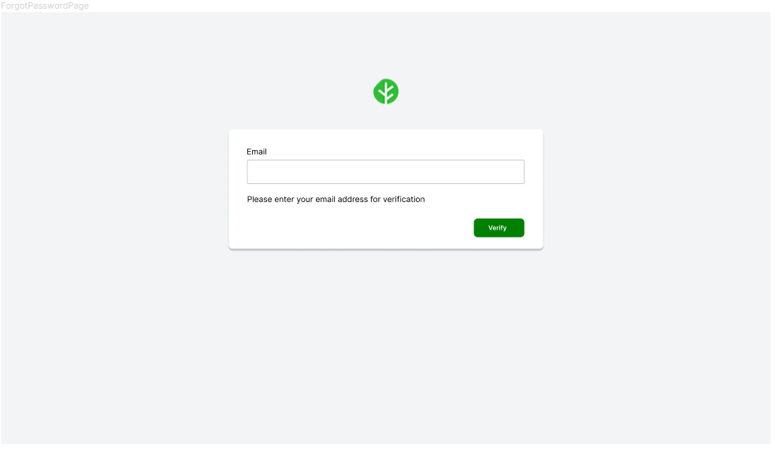
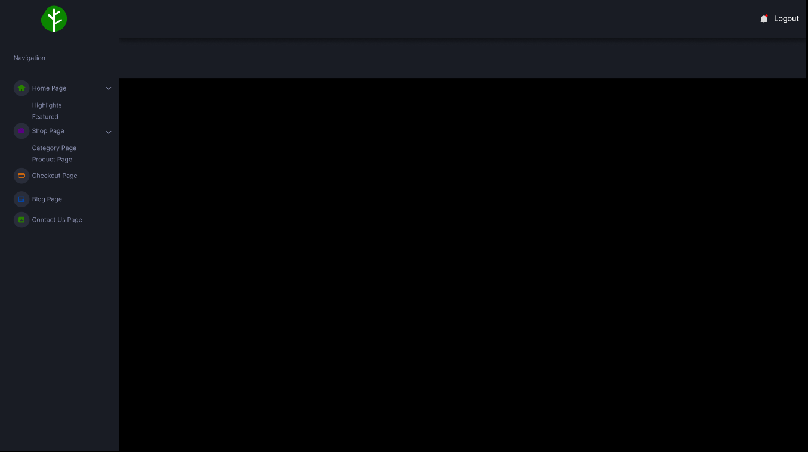
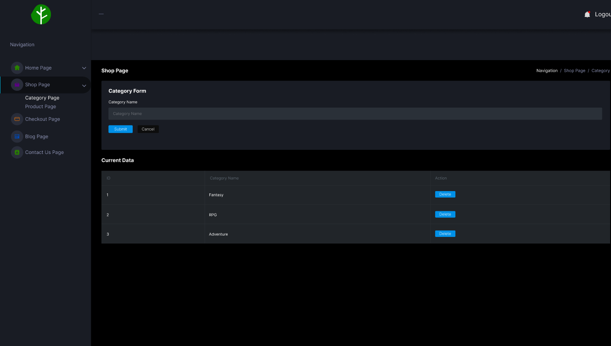

## Projek TKPPL | MORASS

Nama Tim : Blank

Anggota Tim :
- Alvin Goliandi | 191110325
- Richie | 191110368

Judul Prototype : Morass

Deskripsi Prototype : Morass merupakan aplikasi berbasis website dengan tema Digital Game Online Shop yang dikembangkan
dengan framework Laravel dalam penggunaan bahasa pemrograman HTML, CSS, JS, PHP

Link Github : [Morass](https://github.com/PeeOops/Morass)

List User Story :
1. USER Login/Register
- As a user, I can login using my credentials that have been entered in register page so that I could access the web app using my own credentials
- As a user,i can reset my password if i have forgotten my password so that i can gain my access back to the web app

2. USER Shop/Product Page
- As a user, i can view the list of games so that i can see the game that i want
- As a user, i can go to the next page of the games list so that i can save more data without loading all the games
- As a user, i can see the details of the games so that i can decide whether i want to buy the game or not

3. USER Cart Page
- As a user, i can view my shopping cart so that i can see what games i',m buying
- As a user, i can remove games from my shopping cart so that i can remove the game that i don’t want to buy
- As a user, i can edit the quantity of the games so that i can buy more than 1 copy of the game

4. USER Blog Page/Post
- As a user, i can read some blog post about gaming so that i keep updated of daily gaming news from the website

5. USER Checkout Page
- As a user, i can use my owned voucher so that i could save more money when buying the game
- As a user, i can change my address so that i could send the game to another address
- As a user, i can change my payment method so that i could use another payment method that i owned

6. USER Profile Page
- As a user, I can edit my profile data so that I am able to change my profile picture, name and even my security
- As a user, I can select and add new address to my profile so that I can freely change my pickup destination wherever I want
- As a user, I can select and add my payment method so that I can use which method is comfortable for me

7. ADMIN Login
- As a Admin, I can login using my credentials that have been registered so that I could access the web app with admin account

8. ADMIN Dashboard
- As an Admin, I can access the admin dashboard so that i could access and edit data in the admin dashboard

9. ADMIN Category
- As an Admin, I can add a new category for games so that i could categorize our games
- As an Admin, i can delete a category so that i could remove unwanted or unused category

10. ADMIN Product
- As an Admin, I can add a new product so that i could add more products on our shop
- As an Admin, i can delete a product so that i could remove a sold out product

11. ADMIN Checkout
- As an Admin, I can view all checked out carts so that i could see how many orders i have
- As an Admin, i can approve, reject orders so that i could accept or reject orders

12. ADMIN HomePage
- As an Admin, I can Add and Delete Highlight Homepage so that I can change it based on highlighted product
- As an Admin, I can add and delete Featured Games on Homepage so that I can show trending games

13. ADMIN Contact Us

- As an Admin, I can edit the data on the contact us page so that i could renew our contacts

14. ADMIN Blog Page

- As an admin, I can add, edit and delete blog content so that I can give an up to date news for user

Link Trello : [Link Trello](https://trello.com/b/kyD8WQwE/morass-digital-game-online-shop)
